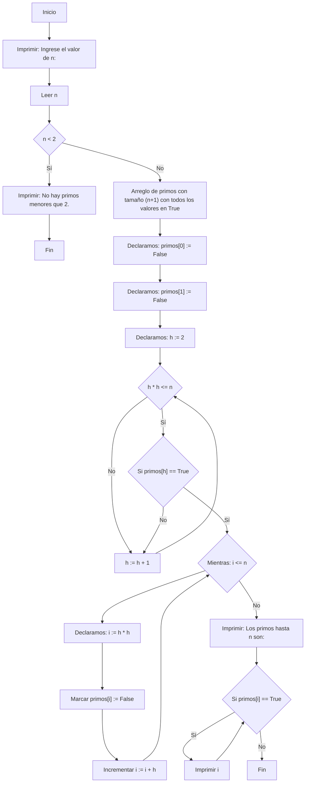

# Reto_03_los_primos_de_n.
El presente repositorio es una guía paso a paso sobre como obtener los primos hasta un número "n" dado, usando pseudocódigo y diagramas de flujo.

## Contenido:
- ¿Qué es un número primo?
- Proceso en pseudocódigo para tener los primos hasta "n".
- Proceso en diagrama de flujo para tener los primos hasta "n".

## ¿Qué es un número primo?
Los primos, números caracterizados por no tener divisores más que ellos mismos y el uno pero, ¿hay alguna manera de determinar los primos hasta un número "n"?
La respuesta es sí, a lo largo de la historia se han desarrollado diferentes métodos para poder hacer esta ardua labor, algunos de los métodos son:
- "Fuerza bruta": Evaluar la divisibilidad de cada número desde 2 hasta n, descártando pares a excepción del 2.
- Criba segmentada: Aplica la Criba de Eratóstenes para rangos mayores, consiste en segmentar los rangos de 2 a n en rangos más pequeños, y aplicar la Criba de Erastóstenes en cada segmento de rango.
- Criba de Eratóstenes: Es un algoritmo que consiste en eliminar los múltiplos de cada primo hasta un número n, para dejar así a los números primos como los que no fueron descartados.

En este caso, por cuestiones de practicidad vamos a utilizar tanto en el diagrama de flujo como en el psudocódigo la Criba de Erastóstenes.

### Pasos a seguir:
1. Paso #1: Generar lista de números.
 - Hacemos una lista de los números desde 2 hasta nuestro número n; dado que en este rango ya se encuentran los primos que buscamos.
2. Paso #2: Procesamiento de números:
 - Empezamos con el primer número primo, h=2.
 - Descartamos todos los múltiplos de h, iniciando desde h^2 hasta n.
3. Paso #3: Seguir al siguiente número:
 - Incrementamos h al siguiente número que no haya sido descartado.
 - Repetimos el procedimiento del paso #2 hasta que h^2 sea mayor que n.
4.  Paso #4: Recolectar los números no descartados:
 - Los números no descartados en la lista, son nuestros números primos.


## Proceso en pseudocódigo de tener los primos hasta "n".
Con base a los pasos para ejecutar la Criba de Erastóstenes realizaremos este paso en pseudocódigo quedando algo tal que así:

```Pseudocódigo:
[Variables]
n : entero # Número ingresado por el usuario.
i : entero # Número contador.
j : entero # Posible divisor de nuestro contador.
es_primo : booleano # Indicará si un número es primo o no.

[Inicio]
# Se inicia el límite.
escribir ("Ingrese un número:")
leer (n)

# En cuyo caso que el número sea menor a dos no tiene primos.
Si (n < 2) entonces
    escribir ("No hay primos menores que 2.")
    salir
fin si

# El mensaje indica el listado de los primos.
escribir ("Los números primos hasta", n, "son:")

# Evaluamos los números desde 2 hasta n.
para i desde 2 hasta n hacer

# Marcamos nuestro primer número de i como primo.
    es_primo := verdadero

#Comprobamos si el número tiene divisores entre 2 y la raíz cuadrada.
    para j desde 2 hasta raíz cuadrada de i hacer
        si (i % j == 0) entonces
# Si hay divisor  (que se comprueba que tenga residuo 0 la división), no es primo.
            es_primo := falso
            salir para
        fin si
    fin para

#Si es primo, pues lo imprimimor.
    si (es_primo) entonces
        escribir (i)
    fin si
fin para

[Fin]

```
## Proceso en diagrama de flujo para tener los primos hasta "n".
Con base a los pasos para ejecutar la Criba de Erastóstenes realizaremos este paso en diaframa de flujo quedando algo tal que así:


# ¡Eso es todo!
